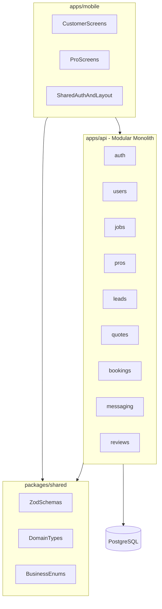
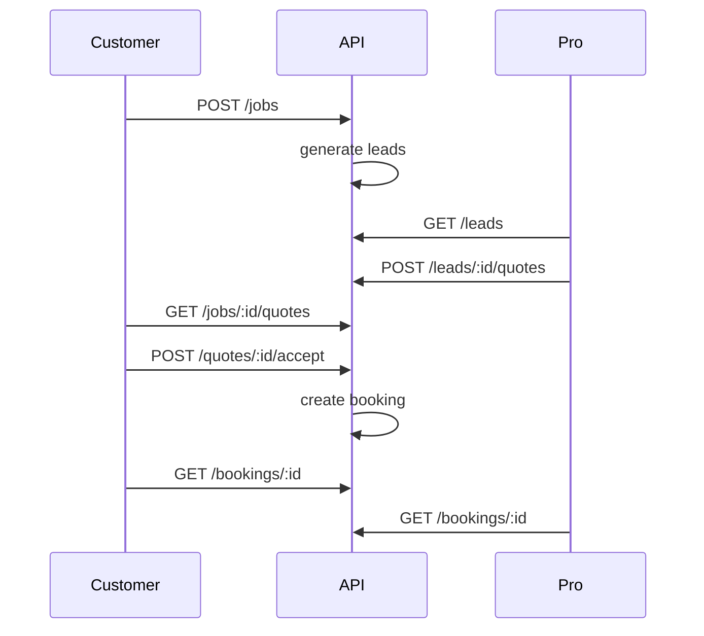

# Marketplace MVP — Daily Phase Plan

This plan turns the **Marketplace Platform MVP** spec into **5 phases / ~15 working days**, each with a clear end-of-day deliverable. The repo starts from zero — Phase 1 is the foundation.

## Guiding constraint

Every day should answer: *Does this help validate the marketplace transaction loop faster, with less complexity?*

Explicitly **out of scope until after MVP validation**: payments, push notifications, background jobs, search infra, recommendations, analytics, complex ranking, multi-tenancy, **automated testing** (unit, integration, E2E).

Validation will be **manual** — walk through flows in the simulator and via curl/Postman. Test suites can be added once the loop is proven.

## Target architecture



**Repo layout** (from spec):

```
apps/
  api/          # Fastify + Drizzle
  mobile/       # Expo + Expo Router
packages/
  shared/       # Zod schemas, types, enums
```

**Suggested tooling** (not in spec, but standard for this shape):

- Package manager: **pnpm workspaces**
- Task runner: **Turborepo** (optional but helps parallel `dev`/`build`)

No test runner setup in early phases — skip Vitest/Jest/Detox scaffolding until post-MVP.

---

## Phase 1 — Foundation (Days 1–3)

Goal: runnable monorepo, backend shell, database pipeline. No business features yet.

### Day 1 — Monorepo scaffold

- Initialize pnpm workspace at repo root
- Create `packages/shared` with TypeScript, Zod, and shared path exports
- Create empty `apps/api` and `apps/mobile` packages
- Root scripts: `dev`, `build`, `lint`, `typecheck`
- Add README with local dev prerequisites (Node, pnpm, PostgreSQL)

**Done when:** `pnpm install` succeeds and `packages/shared` compiles.

### Day 2 — Backend shell

- Fastify app with modular folder structure matching spec modules: `auth`, `users`, `jobs`, `pros`, `leads`, `quotes`, `bookings`, `messaging`, `reviews`
- Health route (`GET /health`)
- Global error handler, request logging, env config (`.env.example`)
- Register route prefixes per module (empty handlers OK)

**Done when:** `pnpm --filter api dev` starts and `/health` returns 200.

### Day 3 — Database layer

- PostgreSQL connection via Drizzle
- Migration workflow (`drizzle-kit generate` / `migrate`)
- Base `users` table stub + migration pipeline proven end-to-end
- Optional: Docker Compose for local Postgres

**Done when:** API starts, connects to DB, and first migration applies cleanly.

---

## Phase 2 — Identity layer (Days 4–6)

Goal: both roles can sign up and authenticate; mobile can call the API.

### Day 4 — Core schema

Define initial tables and enums in Drizzle (keep normalized, MVP-simple):

| Entity | Purpose |
| --- | --- |
| `users` | email, password hash, role (`customer` \| `pro`) |
| `customer_profiles` | display name, location (city/zip for matching) |
| `pro_profiles` | business name, bio, service area |
| `service_categories` | seeded taxonomy (plumbing, cleaning, etc.) |
| `pro_services` | pro ↔ category join |

Mirror enums + request/response shapes in `packages/shared`.

**Done when:** migrations apply and seed script inserts categories.

### Day 5 — Authentication

- Register + login endpoints (separate or role-selected signup)
- JWT access token (refresh tokens deferred for MVP simplicity)
- Auth middleware + `GET /me`
- Shared Zod schemas for auth payloads used by both API and mobile

**Done when:** curl/Postman can register customer + pro, login, and hit protected route.

### Day 6 — Mobile shell + auth

- Expo app with Expo Router
- TanStack Query provider, API client with JWT storage (SecureStore)
- Screens: Welcome, Sign up (role picker), Login, Home stub
- React Hook Form + shared Zod validation

**Done when:** customer and pro can sign up/login on device/simulator and see authenticated home.

**Parallel note:** After Day 5, backend and mobile can split — one person on remaining API endpoints, one on Expo screens.

---

## Phase 3 — Supply & demand (Days 7–9)

Goal: customer can post a job; pro can define what they offer.

### Day 7 — Service categories

- `GET /categories` (public)
- Admin-less seed data in migration or seed script
- Mobile: category picker component reused later in job creation + pro onboarding

**Done when:** categories visible in mobile app.

### Day 8 — Customer job requests

- `jobs` table: category, title, description, location, status (`open` \| `quoted` \| `booked` \| `completed`)
- API: `POST /jobs`, `GET /jobs` (customer's own), `GET /jobs/:id`
- Mobile: Create Job flow + My Requests list

**Done when:** logged-in customer creates a job and sees it in list.

### Day 9 — Professional profiles & services

- API: `PUT /pro/profile`, `GET /pro/profile`, `PUT /pro/services` (category IDs)
- Mobile: Pro onboarding — edit profile, select categories served
- `GET /pros/me` or extend `/me` with pro-specific payload

**Done when:** pro completes profile and selects at least one category.

---

## Phase 4 — Transaction core (Days 10–12)

Goal: the marketplace loop from lead → quote → booking.

### Day 10 — Lead generation

Keep MVP matching **deliberately simple** (spec excludes complex ranking):

```
Match job → pros where:
  1. pro_services.category_id = job.category_id
  2. pro service area overlaps job location (same city/zip prefix)
  3. job status = open
```

- `leads` table: job_id, pro_id, status (`pending` \| `quoted` \| `dismissed`)
- Trigger on job create: insert leads for matching pros
- API: `GET /leads` (pro inbox), `GET /jobs/:id/leads` (customer view, optional)

**Done when:** creating a job generates leads visible to matching pros.

### Day 11 — Quotes

- `quotes` table: lead_id, amount, message, status (`pending` \| `accepted` \| `rejected`)
- API: `POST /leads/:id/quotes` (pro), `GET /jobs/:id/quotes` (customer)
- Mobile: Pro submits quote on lead; customer sees quotes on job detail

**Done when:** pro submits quote; customer sees it on their job.

### Day 12 — Bookings

- `bookings` table: job_id, quote_id, customer_id, pro_id, status (`confirmed` \| `in_progress` \| `completed`)
- API: `POST /quotes/:id/accept` → creates booking, rejects other quotes, updates job status
- Mobile: Customer accepts quote; both parties see booking detail

**Done when:** accepting a quote creates a booking both roles can view.



---

## Phase 5 — Completion loop (Days 13–15)

Goal: satisfy all 11 MVP success criteria from the spec.

### Day 13 — Messaging

MVP-simple: **polling, not WebSockets** (spec excludes push/real-time infra).

- `messages` table: booking_id, sender_id, body, created_at
- API: `GET /bookings/:id/messages`, `POST /bookings/:id/messages`
- Mobile: chat thread screen per booking (TanStack Query refetch interval ~5s)

**Done when:** customer and pro exchange messages on an active booking.

### Day 14 — Completion + reviews

- API: `POST /bookings/:id/complete` (either party or pro-only — pick one rule and stick to it)
- `reviews` table: booking_id, rating (1–5), comment, reviewer_id
- API: `POST /bookings/:id/review` (customer only, after completed)
- Mobile: complete service action + review form

**Done when:** full loop ends with a review on a completed booking.

### Day 15 — Manual demo walkthrough & polish

Walk through spec success criteria manually (simulator + curl/Postman — no automated tests):

1. Customer signs up
2. Professional signs up
3. Customer creates service request
4. Platform generates matching leads
5. Professional receives lead
6. Professional submits quote
7. Customer accepts quote
8. Booking is created
9. Customer and professional communicate
10. Service is completed
11. Customer leaves review

Fix gaps, add minimal error states (empty lists, unauthorized, expired jobs), document demo script in README.

**Done when:** all 11 steps work without manual DB edits.

---

## Scope decisions to lock early (recommended defaults)

These aren't spelled out in the spec but will block daily progress if deferred:

| Decision | MVP recommendation |
| --- | --- |
| App structure | **Single Expo app** with role-based navigation (customer vs pro tabs after login) |
| Location matching | City or ZIP string equality / prefix — no geospatial queries |
| Quote acceptance | One accepted quote per job; auto-reject others |
| Service completion | Pro marks complete → customer can review |
| Messaging | REST + polling, no WebSockets |
| Auth | JWT access token only; short-ish expiry + re-login acceptable for MVP |

---

## What comes after MVP (Phase 6+, not scheduled)

Only after the 11-step loop is proven:

- Automated tests (API integration tests, critical-path E2E)
- Payments (Stripe)
- Push notifications (Expo Notifications)
- Background jobs (lead expiry, reminders)
- Search / filters beyond category
- Pro verification, photos, portfolios
- Admin tooling

---

## Risk watchlist

- **Day 10 matching logic** — biggest product ambiguity; keep rules dumb and visible in code
- **Dual-role UX in one mobile app** — role switch at signup is fine; avoid building two apps
- **Shared package drift** — enforce Zod schemas as single source of truth for every API contract
- **Scope creep** — payments and real-time chat are the most common MVP killers; defer aggressively
